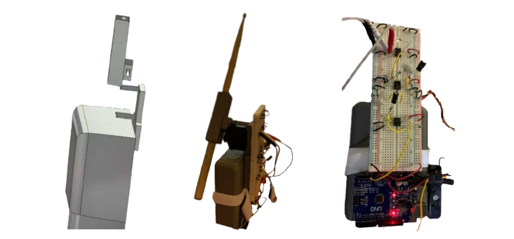

# Drummer's Hand Prosthetic 

Welcome!

## Abstract
Our **hand prosthetic** is designed to empower amputee musicians, particularly drummers, with a tool to enhance their musical expression and performance. By harnessing the strength of their forearm flex, this technology enables them to control the movement of a drumstick. 

At the core lies an electromyography (EMG) system that detects and interprets the electrical signals generated by the drummer's forearm muscles. These signals are then translated into motor commands for the prosthetic, enabling proportional control of the drumstick's distance from the striking surface. We then employed additive manufacturing in the form of 3D printing to materialize our digital design into a tangible and functional prototype. This enabled rapid iteration for fine-tuning the prosthetic's form and function efficiently.

    
    
Left to right: Rough SOLIDWORKS assembly, dimetric view, side view.

## License
This project is licensed under the **Apache 2.0 License**. See the `LICENSE` file for more details. 

## Contact
For questions, feedback, or collaborations, feel free to reach out to the project maintainers at aaren.aras@uwaterloo.ca or w56chan@uwaterloo.ca.

